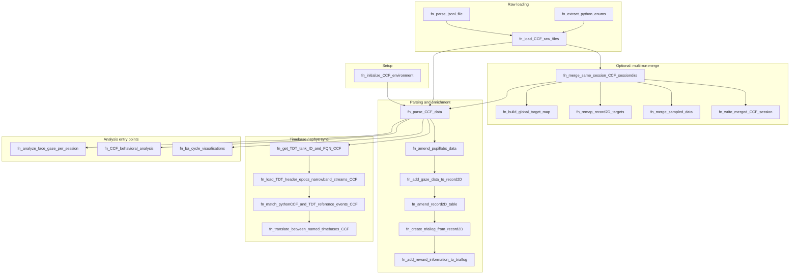

# CCF_analysis_matlab

MATLAB toolbox for loading, merging, parsing, and analyzing CCF ( ) session data from `.sessiondir` folders.

This document is an internal reference for project-authored functions and how they fit together. Third-party TDT SDK code under `CCF_ephys_helper/TDTMatlabSDK_20201007/` is vendored and not enumerated here.

---

## call matlab in cursor:
.\run_matlab.ps1 -BatchCmd "run('CCF_gaze_analysis/fn_analyze_face_gaze_per_session')"

## Overview

A CCF session directory (`.sessiondir`) contains raw experiment files:

| File type | Examples | Role |
|-----------|----------|------|
| HDF5 | `record2D.h5`, `AI_samples.h5`, `DI_samples.h5` | High-rate numeric data |
| JSON | `record2D_header.json`, `conf.json`, `*_header.json` | Column names, config |
| JSONL | `pupillabs_data.jsonl`, `DO_messages.jsonl`, `reward_trains.jsonl` | Event streams |
| Python | `enums.py` | State/event enum definitions |
| CSV | `movement_to_target.csv` | Derived movement metrics |
| Other | `*.sessionID`, `*.txt` | Session metadata |

The toolbox turns these into MATLAB tables/structs (`record2D_table`, `triallog_table`, gaze/fixation structs) for behavioral and ephys analysis.

---

## Pipeline



### Typical workflows

1. **Single session:** `fn_parse_CCF_data(sessiondir_FQN, GAZE_OPTS_struct)`
2. **Multi-run session:** `fn_merge_same_session_CCF_sessiondirs(merge_list_FQN)` → parse merged output
3. **Behavioral analysis:** `fn_CCF_behavioral_analysis(sessiondir, {'per_collection_2D_reach_and_fix_analysis'})`
4. **Face gaze analysis:** `fn_analyze_face_gaze_per_session(runfolder_list)`
5. **Batch discovery:** `test_wrapper()` (host-specific path discovery)

---

## Core data structures

### `raw_data` (from `fn_load_CCF_raw_files`)

```matlab
raw_data.source_dir_FQN
raw_data.session_id, .CCF_pair, .CCF_run, .agent_A_name, .agent_B_name
raw_data.json_struct      % one field per *.json (e.g. conf, record2D_header)
raw_data.h5_struct        % e.g. record2D_data, AI_samples_data
raw_data.jsonl_struct     % parsed JSONL tables
raw_data.csv_struct       % e.g. movement_to_target
raw_data.enums_text       % raw enums.py text
raw_data.enum_struct      % parsed enums
```

### `fn_parse_CCF_data` outputs

| Output | Description |
|--------|-------------|
| `triallog_table` | Per-collection event summary (trials/collections) |
| `record2D_struct` | Header + table for 2D state time series |
| `record_struct` | Legacy 3D record flattening (if `record.h5` present) |
| `sorted_target_state_transition_table` | Target state transitions |
| `AI_samples_struct`, `DI_samples_struct` | Analog/digital input samples + timestamps |
| `json_struct`, `h5_struct`, `txt_struct`, `jsonl_struct` | Raw loaded data |
| `enum_struct` | Parsed `enums.py` |
| `fixations_struct` | Detected fixations (aims, agents, eyes) |
| `GAZE_OPTS_struct` | Gaze processing options (passed through) |

### Merged session extras

`fn_merge_same_session_CCF_sessiondirs` writes:

- `merge_manifest.json` — source runs, collection offsets, target map
- `merged_conf.jsonl` — one `type:"conf"` record per source run (in read order), with `run_idx` and `source_sessiondir_FQN`
- `conf.json` — first run's config (backward compatibility for `fn_parse_CCF_data`)
- `run_idx` column in record2D and JSONL records

---

## Root-level functions (`/`)

| Function | Purpose | Key I/O |
|----------|---------|---------|
| `fn_initialize_CCF_environment` | Add repo to MATLAB path (network-share workaround) | — |
| `fn_load_CCF_raw_files` | Load all raw session files without derived processing | In: `cur_CCF_sessiondir_FQN` → Out: `raw_data` |
| `fn_parse_CCF_data` | **Central orchestrator:** load, gaze enrichment, triallog, AI/DI timestamps, TDT sync, caching | In: sessiondir list, `GAZE_OPTS_struct` → Out: triallog, record structs, samples, jsonl, fixations |
| `fn_amend_record2D_table` | Enrich record2D: NaN invalid positions, distances to targets/agents/aims/face, fixation detection | In: `record2D_table`, `conf_struct`, `request_list`, thresholds → Out: amended table, `fixations_struct` |
| `fn_create_triallog_from_record2D` | Build per-collection triallog from record2D + enums | In: sessionID, record2D, enums, target_radius → Out: triallog, record2D, target transition table |
| `fn_add_reward_information_to_triallog` | Add reward pulse/train columns from `reward_trains` jsonl | In: triallog, reward_trains table → Out: triallog |
| `fn_parse_jsonl_file` | Parse JSONL file line-by-line into table | In: `jsonl_FQN` → Out: `parsed_data_table` |
| `fn_write_jsonl_file` | Write table to JSONL (inverse of parse) | In: `output_FQN`, `data_table` |
| `fn_extract_python_enums` | Build enum struct from `enums.py` | In: `python_enum_FQN` → Out: `enum_struct` |
| `fn_extract_event_ts_from_photodiode_AI_samples` | Detect photodiode onset/offset from AI samples | In: timestamps, data, collection labels, threshold → Out: `onset_offset_events_struct` |
| `fn_create_feature_list_from_id_start_end_ts_lists` | Label each sample with feature ID from start/end intervals | In: sample timestamps, id/start/end lists → Out: `per_sample_feature_list` |
| `fn_estimate_per_sample_timestamps_for_h5table` | Interpolate per-sample timestamps for h5 datasets | In: base name, h5/json structs → Out: timestamp list, data struct |
| `fn_ba_cycle_visualisations` | Behavioral-analysis cycle visualizations over session runfolders | In: `cur_CCF_runfolder_FQN_list` |
| `test_wrapper` | Host-aware batch driver for discovering/processing CCF session dirs | — |

**Local helpers in `fn_parse_CCF_data`:** `fn_save_figure`, `fn_convert_header_table_timestamp_list_struct_to_table`

**Local helper in `fn_extract_event_ts_from_photodiode_AI_samples`:** `fnFixVisualChangeTimesFromPhotodiodeSignallog`

### `fn_parse_CCF_data` internal stages (per sessiondir)

1. Discover and load JSON, H5, TXT, sessionID, JSONL files
2. Parse `enums.py`; locate TDT tank via `fn_get_TDT_tank_ID_and_FQN_CCF`
3. Parse JSONL (with optional `.mat` cache); amend PupilLabs via `fn_amend_pupillabs_data`
4. Build CCF↔TDT timebase conversion if DO messages + TDT tank exist
5. Estimate AI/DI per-sample timestamps
6. Flatten legacy `record.h5` if present
7. Build `record2D_table` from `record2D.h5` + header
8. Merge gaze into record2D via `fn_add_gaze_data_to_record2D`
9. Amend record2D via `fn_amend_record2D_table` (distances, fixations)
10. Create triallog via `fn_create_triallog_from_record2D`
11. Add reward info via `fn_add_reward_information_to_triallog`
12. Collect fixations around triallog event ticks

---

## `CCF_merge_runs/`

Merge multiple interrupted runs of the same session into one parseable `.sessiondir`.

| Function | Purpose | Key I/O |
|----------|---------|---------|
| `fn_merge_same_session_CCF_sessiondirs` | **Main merge orchestrator** | In: merge list FQN(s) → Out: merged sessiondir path(s) |
| `fn_merge_same_session_CCF_sessiondirs_SM` | SM variant / dev entry (TDT timebase translation planned) | In: merge list FQN |
| `fn_build_global_target_map` | Assign consistent global target slots across runs | In: `raw_data_list` → Out: `global_target_map` |
| `fn_remap_record2D_targets` | Remap per-run target columns to global slot layout | In: header, data, local→global map → Out: remapped header/data |
| `fn_merge_sampled_data` | Concatenate AI/DI samples across runs with gap filling | In: `raw_data_list`, sample type, fill value → Out: merged data + timestamps |
| `fn_write_merged_CCF_session` | Write merged session to disk in original CCF formats | In: output dir, `merged_data_struct` |

### Merge steps (`fn_merge_same_session_CCF_sessiondirs`)

1. Read merge list (one sessiondir per line)
2. Load each run via `fn_load_CCF_raw_files`
3. Verify `enums.py` identical across runs
4. Build global target map; compute collection offsets
5. Merge `record2D` (target remap, collection offset, cumulative score carry-over, `run_idx`)
6. Merge AI/DI samples with inter-run gap fill
7. Stream-merge JSONL files (offset `collection_number`, add `run_idx`)
8. Merge CSV (`movement_to_target`: offset cycle and `_frame` columns)
9. Build `merge_manifest.json`
10. Write via `fn_write_merged_CCF_session`

**Local helpers in `fn_write_merged_CCF_session`:** `fn_write_h5_dataset`, `fn_write_json_file`, `fn_write_heterogeneous_jsonl_file`

---

## `CCF_gaze_analysis/`

| Function | Purpose | Key I/O |
|----------|---------|---------|
| `fn_add_gaze_data_to_record2D` | Merge PupilLabs gaze subtables into record2D columns | In: data table, gaze struct, tracker config, regexp filters, request list → Out: data table |
| `fn_amend_pupillabs_data` | Process PupilLabs jsonl: fix timestamps, iDT fixations, DVA, registration | In: pupillabs struct, runfolder, conf, sessionID, requests, `GAZE_OPTS_struct` → Out: amended struct |
| `fn_analyze_face_gaze_per_session` | Session-level face/partner gaze analysis (calls `fn_parse_CCF_data`) | In: runfolder list |
| `fn_calculate_gaze_sample_count_and_proportions_per_object` | Gaze sample counts/proportions per reference object (struct output) | In: subtable, sample stem, ref objects, thresholds, method, prefix/suffix → Out: `out_struct` |
| `fn_calculate_gaze_sample_proportions_per_object` | Same logic, vector outputs | Out: proportions, counts, total, object names |
| `fn_convert_pixels_2_DVA_CCF` | Convert screen pixels to degrees visual angle | In: x/y pix, screen geometry → Out: x/y deg |
| `fn_gaze_recalibrator_v02_CCF` | Calibrate gaze via dot-following; `fitgeotrans` registration | In: runfolder, gaze data, calibration table, logfile, conf, tracker params → Out: `registration_struct` |
| `fn_shorten_object_name_list` | Abbreviate long object/column names for reporting | In: object name list, prefix, suffix → Out: shortened names |
| `fn_spatial_dispersion_fixation_detector_CCF` | iDT spatial-dispersion fixation detector (Salvucci & Goldberg 2000) | In: trial struct (timestamp, X, Y), thresholds, `isDraw` → Out: `fixation` |

**Local helpers in `fn_gaze_recalibrator_v02_CCF`:** coordinate conversion, robust mean, plotting, `fitgeotrans`, session/tracker name parsing, gain/offset calibration

**Local helper in `fn_add_gaze_data_to_record2D`:** `fn_shorten_subtable_name_to_stem`

---

## `CCF_data_helper/`

Low-level table/coordinate utilities used across parsing and analysis.

| Function | Purpose | Key I/O |
|----------|---------|---------|
| `fn_CCF_engine_to_win_pos` | CCF engine pixel → relative playing-field coordinates | In: X/Y pixel, field_size, target_radius, offsets → Out: X/Y rel |
| `fn_CCF_win_to_engine_pos` | Relative playing-field coordinates → pixel space | In: X/Y rel, field params → Out: X/Y pixel |
| `fn_categorize_reach_from_start_and_end_XY` | Categorize reach direction (L/R, U/D) and polar coords | In: start/end XY lists → Out: categorical labels, delta, polar |
| `fn_collect_fixation_data_around_tick` | Prev/current/next fixation around tick indices | In: fixations struct, tick idx list → Out: 9 fixation metric vectors |
| `fn_collect_fixations_around_tick_idx_lists` | Add fixation onset/offset/XY columns to triallog at event ticks | In: triallog, fixations, include list, record2D, tick col names → Out: triallog |
| `fn_find_next_change_in_logical` | Find last index before next change in logical vector | In: logical, start_idx, increment → Out: last idx |
| `fn_generate_key_from_selected_table_columns_CCF` | Composite keys from table/struct columns (grouping/joins) | In: keyfield list, data, separator → Out: keys, unique keys, counts |
| `fn_get_column_name_indices_struct` | Map column names → index struct for stable column addressing | In: name list, start_val → Out: `columnnames_struct`, `n_fields` |

### Vendored: `CCF_data_helper/3rd_party/DataHash_20190519/`

| Function | Purpose |
|----------|---------|
| `DataHash` | Checksum/hash for MATLAB arrays (used for parse caches) |
| `uTest_DataHash` | Unit tests for DataHash |

---

## `CCF_ephys_helper/` (project code)

TDT tank loading and CCF↔ephys timebase alignment. Uses vendored `TDTbin2mat.m`.

| Function | Purpose | Key I/O |
|----------|---------|---------|
| `fn_get_TDT_tank_ID_and_FQN_CCF` | Locate TDT tank ID and path under session TDT subdir | In: sess_dir, session_ID, TDT subdir → Out: tank ID, FQN, base dir |
| `fn_load_TDT_header_epocs_narrowband_streams_CCF` | Load TDT header, epocs, RZ2 analog streams via `TDTbin2mat` | In: tank FQN/ID, suffix, load flag → Out: header, epocs, streams |
| `fn_compress_TDT_stream_to_epoc_by_change_detection_CCF` | Compress TDT stream to epoc by value-change detection | In: `TDT_stream` → Out: `output_epoc_struct` |
| `fn_match_pythonCCF_and_TDT_reference_events_CCF` | Match CCF digital-out messages to TDT reference epocs for sync | In: `REF_EPOC`, DO message table, TDT epocs → Out: matched idx/timestamps |

---

## `CCF_behavioral_analysis/`

| Function | Purpose | Key I/O |
|----------|---------|---------|
| `fn_CCF_behavioral_analysis` | Behavioral analysis dispatcher; parses session then runs requested analyses | In: sessiondir, `requested_analyses_list` → Out: `output` |
| `fn_per_collection_2D_reach_and_fix_analysis` | Per-collection 2D reach + fixation plots/analysis | In: triallog, record2D, conf, enums, fixations, source lists, plot opts → Out: `cur_output` |

Currently supports analysis: `per_collection_2D_reach_and_fix_analysis`.

---

## `CCF_plotting_helper/`

Reusable figure/axes utilities for behavioral and ephys plots.

| Function | Purpose | Key I/O |
|----------|---------|---------|
| `fn_BoS_ephys_default_plotting_options` | Default figure/font/panel sizing presets for BoS ephys plots | In: `set_string` → Out: options struct |
| `fn_delete_children_from_axis_handle` | Delete axis children, optionally filtered by property regexp | In: axis handle, child indices, selection filters |
| `fn_find_object_by_field_regexp` | Filter object array by property matching regexp list | In: object array, property name, regexp list → Out: match/nonmatch ldx |
| `gaussian_attention_map` | Draw 2D Gaussian attention map over fixations (optional image overlay) | In: x, y, sigma, optional t/image/roi → Out: axes handle |
| `fn_manipulate_properties_by_objecthandles` | Bulk set graphics object properties by handle list | In: manipulation mode, handles, property list, values |
| `fn_open_matlab_figure` | Open `.fig` via `openfig` or manual hgS recovery | In: `cur_fig_fqn` → Out: figure handle, axis list |
| `fn_set_axis_properties_from_struct` | Apply struct fields to axis via `set()` | In: `cur_ah`, plotting options struct |

---

## `timebase_conversion/`

Align timestamps between CCF (EventIDE/Python), gaze trackers, and TDT ephys.

| Function | Purpose | Key I/O |
|----------|---------|---------|
| `fn_create_timing_conversion_struct_CCF` | Compute scale/offset between two timebases from common events | In: two timebase names + event lists → Out: bidirectional conversion structs |
| `fn_convert_time_between_named_timebases_CCF` | Apply named timebase conversion to event list | In: events, conversion struct, from/to names → Out: converted events |
| `fn_translate_between_named_timebases_CCF` | High-level TDT↔CCF sync wrapper with QC histogram plot | In: REF_EPOC, two timebase names, timestamps, TDT dir → Out: conversion structs |
| `fn_find_closest_tick_idx_for_timestamp_list` | Nearest reference tick index for each timestamp | In: reference timestamps, query list → Out: idx list, distances |
| `fn_correct_remote_network_timestamps` | Correct EventIDE timestamps using tracker remote timestamps | In: tracker name, local/remote ts, log FQN → Out: col header, corrected ts |

---

## External dependencies (outside this repo)

Referenced by project code but not defined here:

- `fn_parse_session_id` — parse session ID string into struct
- `fn_sanitize_value_as_matlab_variable_name` / `fn_sanitize_string_as_matlab_variable_name`
- `fn_set_figure_outputpos_and_size`
- Other SCP shared utilities on the lab path

---

## Naming conventions

| Pattern | Meaning | Example |
|---------|---------|---------|
| `fn_` prefix | All toolbox functions | `fn_parse_CCF_data` |
| `_FQN` suffix | Full file/dir path | `cur_CCF_sessiondir_FQN` |
| `_list` suffix | Array or cell array | `sessiondir_merge_list` |
| `_struct` suffix | Structure | `fixations_struct` |
| `_table` suffix | MATLAB table | `triallog_table` |
| `_ldx` suffix | Logical index mask | `valid_ldx` |
| `_idx` suffix | Numeric index | `tick_idx` |
| `cur_` prefix | Current loop item | `cur_sessiondir` |
| `i_` prefix | Loop iterator | `i_run` |
| `n_` prefix | Count | `n_runs` |

---

## Function count summary

| Module | Project functions |
|--------|-------------------|
| Root | 14 |
| CCF_merge_runs | 6 |
| CCF_gaze_analysis | 10 |
| CCF_data_helper | 8 (+ 2 vendored) |
| CCF_ephys_helper | 4 |
| CCF_behavioral_analysis | 2 |
| CCF_plotting_helper | 7 |
| timebase_conversion | 5 |
| **Total** | **56 top-level + local helpers** |

---

## Vendored third-party code

`CCF_ephys_helper/TDTMatlabSDK_20201007/` — Tucker-Davis Technologies MATLAB SDK (bin2mat reader, filters, NEX export, Synapse API, examples). Project code depends primarily on `TDTbin2mat.m`.
